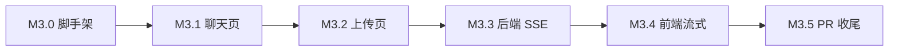

# M3 分步指南：React 前端 + SSE 流式

M3 拆成 **5 小步**，每步只做一件事、本地验收后再进下一步。
从 M3 起走 **PR 流程**：全程在 `feature/m3-react` 分支开发，M3.5 验收通过后开 PR 合并。

**当前进度：M3.5 代码与文档已更新，待你验收 + 开 PR 合并**

---

## 总览



| 步骤 | 做什么 | 预计 session | 验收重点 |
|------|--------|-------------|----------|
| **M3.0** | 开分支 + Vite/React 脚手架 + CORS | 1 次 | 浏览器能打开空白前端页 |
| **M3.1** | 聊天 UI，调现有 `POST /chat` | 1 次 | 浏览器里能对话、看到 sources |
| **M3.2** | 上传 PDF + 向量库统计 UI | 1 次 | 浏览器里完成「上传 → 提问」全流程 |
| **M3.3** | 后端 `POST /chat/stream` SSE 接口 | 1 次 | Swagger/curl 能看到逐字输出 |
| **M3.4** | 前端接 SSE + 打字机效果 | 1 次 | 聊天框里流式显示回复 |
| **M3.5** | 联调 polish + 问答卡 + 开 PR | 1 次 | PR 合并进 master |

---

## M3.0 开分支 + 前端脚手架

**目标**：前后端能同时跑，浏览器能访问 React 页面。

### 要做的事

| 项 | 说明 |
|----|------|
| Git | `git checkout -b feature/m3-react` |
| 前端 | `frontend/`：Vite + React + TypeScript |
| 后端 | FastAPI 加 CORS（开发时前端 `5173` 调后端 `8000`） |
| 脚本 | 可选：`scripts/dev.ps1` 一键启前后端 |

### 不做的事

- 还不接聊天逻辑
- 还不做 SSE

### 验收

1. 后端：`uv run python main.py` → `/health` 正常
2. 前端：`cd frontend && npm run dev` → 打开 http://127.0.0.1:5173 看到占位页
3. 前端页面能 `fetch('http://127.0.0.1:8000/health')` 成功（证明 CORS 通了）

### 面试题

完整问答见 [qa-m3.md](./qa-m3.md) → **M3.0 章节**（4 题含答案 + 自检清单）。

---

## M3.1 聊天页（非流式）

**目标**：用 React 替代 Swagger 测 `/chat`，先跑通最简闭环。

```
浏览器输入 → POST /chat → 显示 reply + sources
```

### 新增/改动

| 文件 | 作用 |
|------|------|
| `frontend/src/components/ChatPanel.tsx` | 输入框 + 消息列表 |
| `frontend/src/api/chat.ts` | 封装 `POST /chat` |
| `frontend/src/App.tsx` | 布局：聊天区 |

### 功能范围

- 输入问题 → 发送 → 显示 AI 回复
- `use_rag: true`（默认），展示 `sources` 引用列表
- 加载中状态（转圈/禁用按钮）
- **先不做**流式、历史记录、Markdown 渲染

### 验收

1. 确保已上传 PDF（或先用 Swagger 上传一次）
2. 在前端问：「骆健渤做过什么项目？」
3. 期望：看到 `reply` + 带来源的 `sources`

### 面试题

完整问答见 [qa-m3.md](./qa-m3.md) → **M3.1 章节**。

---

## M3.2 上传 + 向量库统计

**目标**：浏览器里完成完整 RAG 流程，不再依赖 Swagger。

```
上传 PDF → 看 stats → 聊天提问
```

### 新增/改动

| 文件 | 作用 |
|------|------|
| `frontend/src/components/UploadPanel.tsx` | 选文件 + 上传进度 |
| `frontend/src/api/documents.ts` | `upload` + `stats` |
| `frontend/src/App.tsx` | 侧边栏：上传区 + 统计数字 |

### 功能范围

- 选 PDF → `POST /documents/upload`
- 显示 `chunk_count`、`vector_count`、`embedding_model`
- 上传成功后刷新 stats
- 简单错误提示（非 PDF、空文件等）

### 验收

1. 前端上传 PDF → 显示切块数和向量数
2. 立刻在聊天区提问 → 回答基于刚上传的文档
3. 全程不用打开 `/docs`

### 面试题

完整问答见 [qa-m3.md](./qa-m3.md) → **M3.2 章节**。

---

## M3.3 后端 SSE 流式接口

**目标**：后端支持逐 token 推送，前端暂时还不用改。

```
POST /chat/stream → SSE 事件流 → 客户端逐字收到
```

### 新增/改动

| 文件 | 作用 |
|------|------|
| `app/llm.py` | 新增 `chat_stream()`，用 `astream` |
| `app/rag/rag.py` | 新增 `rag_chat_stream()` |
| `main.py` | 新增 `POST /chat/stream`，`StreamingResponse` |

### 技术要点

- 响应头：`Content-Type: text/event-stream`
- 事件格式：`data: {"token": "你"}\n\n`
- 结束时发：`data: {"done": true, "sources": [...]}\n\n`
- RAG 路径：先 retrieve（非流式），再流式 generate

### 验收

1. Swagger 或 curl 调 `/chat/stream`
2. 终端/浏览器能看到文字一段段出来
3. RAG 模式下最后一条事件带 `sources`

### 面试题

完整问答见 [qa-m3.md](./qa-m3.md) → **M3.3 章节**。

---

## M3.4 前端接 SSE + 打字机

**目标**：聊天框里看到 AI 一个字一个字打出来。

```
用户发送 → fetch /chat/stream → 读 ReadableStream → 实时更新 UI
```

### 新增/改动

| 文件 | 作用 |
|------|------|
| `frontend/src/api/chatStream.ts` | 读 SSE / fetch stream |
| `frontend/src/components/ChatPanel.tsx` | 流式更新当前消息气泡 |
| 可选开关 | 「流式 / 非流式」切换，方便对比 |

### 功能范围

- 发送后先占位空消息，逐 token 追加
- 流结束后显示 sources
- 流式过程中禁用重复发送
- 错误处理：断流、500

### 验收

1. 提问后看到打字机效果
2. 结束后 sources 正常显示
3. 关闭流式开关时仍可用 M3.1 的非流式路径

### 面试题

完整问答见 [qa-m3.md](./qa-m3.md) → **M3.4 章节**。

---

## M3.5 联调 polish + PR 合并

**目标**：M3 可交付、可讲、可合并。

### 要做的事

| 项 | 说明 |
|----|------|
| UI | 简单样式统一（Tailwind 或现有 CSS） |
| README | 补充前端启动说明 |
| 问答卡 | 新建/更新 [qa-m3.md](./qa-m3.md)（M3.5 章节总验收） |
| Git | commit → push → `gh pr create` → review → merge |
| PLAN | 更新 `docs/PLAN.md` 勾选 M3 完成 |

### 验收

1. 新人按 README 能启前后端
2. 完整流程：上传 PDF → 流式提问 → 看引用
3. 能口述 M3 数据流（见 qa-m3）
4. PR 合并进 master

### 面试题

完整问答见 [qa-m3.md](./qa-m3.md) → **M3.5 章节**（总验收 3 题含答案）。

---

## 推荐节奏

| 你的时间 | 做什么 |
|----------|--------|
| 有空 1～2 小时 | 完成一步 M3.x + 验收 + 面试题 |
| 只有 30 分钟 | 复习上一步验收标准，或补做未完成的 UI 细节 |
| 很忙 | 不要开新步，保持分支不动即可 |

---

## 下一步

说 **「继续 M3.0」** 开始：开分支 + 搭 Vite/React 脚手架。
