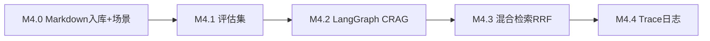

# M4 分步指南：项目真实化 + 高 star 亮点

> 前置：M3 全栈完成并 PR 合并。  
> 业务场景见 [SCENARIO.md](./SCENARIO.md)。  
> 场景面试题见 [qa-scenario-guide.md](./qa-scenario-guide.md)。

**当前进度：M4.3 已完成代码，待你验收（下一步 M4.4 trace_id）**

---

## 总览

| 子步 | 做什么 | 对标 GitHub | 场景题重点 |
|------|--------|-------------|-----------|
| M4.0 | 索引 `docs/*.md` + README 场景化 | Onyx 文档源 | 知识库更新/多格式 |
| M4.1 | eval 20 题 + Recall@3 | 腾讯面经 | 「召回率多少」 |
| M4.2 | LangGraph 评分→改写→拒答 | agentic-rag-for-dummies 3.6k | Retrieve vs Generate |
| M4.3 | BM25+向量 RRF | CliffsCai 92 | 精确搜 API 名 |
| M4.4 | trace_id 检索日志 | rag_api 862 | Bad case 定位 |

---

## M4.0 真实文档入库

**目标**：知识库内容从「随便一个 PDF」变成「本项目真实 Wiki」。

### 要做的事

- 支持上传/索引 `.md` 文件（`docs/` 一键导入脚本或 API）
- README 改为 DevKit 场景描述（链到 SCENARIO.md）
- 前端示例问题改为：「M2 数据流？」「CORS 怎么验收？」

### 验收

- 问「M3 分几步」→ 回答引用 `docs/M3-steps.md`
- 不再依赖外部简历 PDF 也能演示

### 场景题

见 [qa-scenario-guide.md](./qa-scenario-guide.md) → 文档更新/多格式

---

## M4.1 评估集（面经硬性要求）

**目标**：能回答「召回率多少」并有脚本可复现。

### 要做的事

- `eval/questions.json`：20 题，含 `question`、`expected_sources`、`should_abstain`
- `eval/run_eval.py`：跑检索，输出 Recall@3
- `eval/BASELINE.md`：记录 M2/M4.3 前后数字

### 验收

- 终端一条命令出报告
- 你能口述指标含义

### 场景题

「你做了 RAG，召回率多少？怎么量的？」

---

## M4.2 LangGraph CRAG

**目标**：检索质量差时自动改写 query；无关则拒答。

### 要做的事

- `app/rag/graph.py`：LangGraph 状态机
- 节点：retrieve → grade → (rewrite | generate | abstain)
- 参考 [agentic-rag-for-dummies](https://github.com/GiovanniPasq/agentic-rag-for-dummies) 模块化结构

### 验收

- 故意问文档没有的内容 → 拒答
- 模糊问法 → 改写后检索改善（对比 eval 集）

### 场景题

「回答不准，怎么判断 Retrieve 还是 Generate？」

---

## M4.3 混合检索 RRF

**目标**：搜 `POST /chat`、`CORSMiddleware` 等精确词更准。

### 要做的事

- BM25 索引（可 `rank_bm25` 或 ES 简化版）
- 与向量结果 RRF 融合
- 参考 [CliffsCai/Rag_System](https://github.com/CliffsCai/Rag_System)

### 验收

- eval 集 Recall@3 比 M4.1 基线提升（记录数字）
- 演示：纯向量 vs 混合检索对比一题

### 场景题

「用户搜 API 路径搜不到，你怎么优化？」

---

## M4.4 可观测性

**目标**：单次请求可回放检索过程，定位 Bad case。

### 要做的事

- 每个 `/chat` 请求带 `trace_id`
- 日志：query、top_k 片段 id、scores、是否改写
- 参考 [danny-avila/rag_api](https://github.com/danny-avila/rag_api) 的 API 设计思路

### 验收

- 给 trace_id 能说出当次检索了哪些块
- 口述一次你修复过的 bad case（可用 eval 失败样例）

### 场景题

「线上用户反馈答错了，你怎么查？」

---

## 下一步

M4.4 完成后进入 [M5-steps.md](./M5-steps.md)（M5.3 为 pgvector 最小迁移，放最后）。
