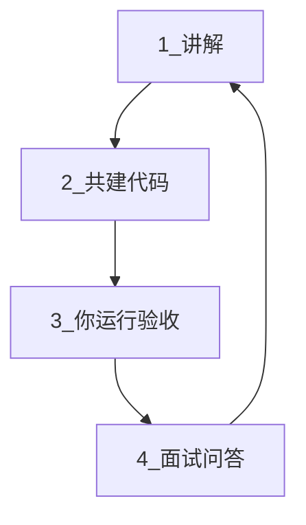
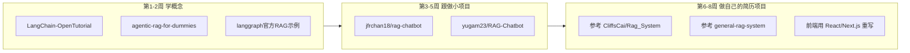

# 学习计划（左侧可见 · 随对话更新）

> 工作区副本：在资源管理器打开 `docs/PLAN.md` 即可。每次协作推进里程碑后，我会同步更新本文件。

## 当前进度

- [x] **M0** 环境：uv + Python 3.12 + FastAPI `/health`
- [x] **M1** 首个 LLM：DeepSeek + `/chat` + [qa-m1.md](./qa-m1.md)
- [ ] **M2** 基础 RAG：PDF 上传 → 切块 → 检索 → 问答 ← **进行中**
  - [x] **M2.1** PDF 上传 + 切块 → [M2-steps.md](./M2-steps.md)
  - [ ] **M2.2** Embedding + Chroma
  - [ ] **M2.3** 检索 + RAG 问答
- [ ] **M3** 全栈：React 前端 + SSE 流式
- [ ] **M4** 进阶：LangGraph 或混合检索
- [ ] **M5** 简历交付：Docker + README + 面试 20 题

**有空时说**：「继续 M2.2」（当前 M2.1 待验收）

---

<!-- 以下为完整计划正文 -->

# GitHub 企业知识库 RAG 项目推荐计划

你选择了 **企业知识库 RAG** + **约 8 周** 时间，并希望在 AI 帮助下完成搭建、同时掌握面试知识点。**这个思路完全可行，也是更高效的路径**——前提是用对方法，避免「代码跑通了但面试讲不清」。

---

## 协作学习模式（核心调整）

### 为什么这个思路好

- 你有 **TS/前端基础**，Python/RAG 从零摸索会卡在环境、语法、框架概念上，协作可跳过大量试错时间
- 面试考的是 **原理 + 架构 +  trade-off**，我可以每步对应讲解「面试官会问什么」
- 8 周实习期时间紧，**共建比纯自学更现实**

### 必须避免的坑

| 风险 | 对策 |
|------|------|
| 只会跑 Demo，讲不清数据流 | 每个模块完成后，你用自己话 **口述一遍流程**（我验收） |
| 简历写了但没参与 | 每个 PR/模块你至少 **改 1-2 处** 并理解为什么 |
| 面试被追问细节露馅 | 每阶段产出 **面试问答卡**（见下文） |
| 依赖 AI 写代码 | 我讲解 → 我搭骨架 → **你确认/小改** → 你复述原理 |

### 每次协作的标准四步



1. **讲解（5-10 分钟）**：这步解决什么问题？业界怎么做？面试怎么问？
2. **共建代码**：我在 `E:\langChain` 里搭建，边做边标注关键文件
3. **你验收**：你本地跑通，对照架构图指出「请求从哪进、从哪出」
4. **面试问答**：我出 3-5 道追问，你用口头或文字回答，不过关则回看该模块

### 每阶段交付物（不只是代码）

| 阶段 | 代码交付 | 知识交付 |
|------|---------|---------|
| 第 1-2 周 | 最小 Chatbot + 环境 | 问答卡：LangChain 核心概念、Chain vs Agent |
| 第 3-4 周 | PDF 上传 + 基础 RAG 全栈 | 问答卡：RAG 五步、Embedding、向量检索原理 |
| 第 5 周 | 混合检索 or 文档评分 | 问答卡：BM25 vs 向量、RRF、幻觉怎么降 |
| 第 6-8 周 | 完整简历项目 + Docker | 问答卡 20 题 + 架构图 + 3 分钟项目介绍稿 |

---

## 总体策略



**重要原则**：GitHub 上的项目是用来 **学习和对标架构** 的，简历上应写 **你自己从零搭建或深度改造的版本**，README 里说明「参考了哪些开源项目、做了哪些改进」。

---

## 第一层：教程/概念（第 1-2 周，只学不做大项目）

### 1. [LangChain-OpenTutorial/LangChain-OpenTutorial](https://github.com/LangChain-OpenTutorial/LangChain-OpenTutorial)（~1k stars）

- **用途**：系统教程，Jupyter Notebook 形式，覆盖 LangChain + LangGraph
- **重点章节**：RAG 基础、Adaptive RAG、Agentic RAG、Memory
- **在线阅读**：[langchain-opentutorial.gitbook.io](https://langchain-opentutorial.gitbook.io/langchain-opentutorial)
- **为什么适合你**：有结构化学习路径，比零散博客效率高；Adaptive/Agentic RAG 正是 2026 面试热点

### 2. [GiovanniPasq/agentic-rag-for-dummies](https://github.com/GiovanniPasq/agentic-rag-for-dummies)（~3.5k stars）

- **用途**：模块化 Agentic RAG，LangGraph + 对话记忆 + 人机协同澄清
- **特点**：教程 + 可运行项目双路径；支持 Ollama/OpenAI/Anthropic/Google
- **学到什么**：BM25 混合检索、LangGraph 状态机、项目目录怎么拆
- **建议**：先跑通 Gradio Demo，再读 `Building Path` 的模块化代码

### 3. [langchain-ai/langgraph](https://github.com/langchain-ai/langgraph) 官方 RAG 示例

- **路径**：`examples/rag/` 目录（Agentic RAG、Adaptive RAG、Self-RAG、CRAG）
- **文档**：[docs.langchain.com LangGraph 指南](https://docs.langchain.com/oss/python/langgraph/overview)
- **用途**：理解「自反思 RAG」的标准实现——路由、文档评分、查询改写、Web 搜索兜底
- **注意**：部分旧 notebook 已归档，以官方 docs 为准

### 4. 项目灵感索引（按需查阅，不必全看）

- [ashishpatel26/500-AI-Agents-Projects](https://github.com/ashishpatel26/500-AI-Agents-Projects)（~33k stars）
- **用途**：500+ Agent 项目合集，按框架/行业分类；找「知识库问答」「Adaptive RAG」等场景的参考链接

---

## 第二层：入门全栈 RAG（第 3-5 周，fork 练手）

这两个项目体量适中，**FastAPI + 前端**，非常适合你从 TS 背景切入 Python 后端。

### 5. [jfrchan18/rag-chatbot](https://github.com/jfrchan18/rag-chatbot)

- **栈**：FastAPI + PostgreSQL/pgvector + LangChain + React
- **功能**：PDF 上传、向量检索、聊天历史、Docker Compose
- **Stars**：较少，但结构清晰，适合第一周练手
- **练什么**：理解 RAG 最小闭环（上传 → 切块 → Embedding → 检索 → 生成）

### 6. [yugam23/RAG-Chatbot](https://github.com/yugam23/RAG-Chatbot)

- **栈**：FastAPI + LangChain + FAISS + **React 19 + TypeScript + Tailwind**
- **功能**：PDF 上传、流式聊天、历史记录、Rate Limit、Sentry
- **为什么更推荐**：前端技术栈和你一致（React/TS/Tailwind），读代码阻力小
- **练什么**：FastAPI 路由分层、Pydantic 校验、前端对接 API

**8 周内建议**：以 [yugam23/RAG-Chatbot](https://github.com/yugam23/RAG-Chatbot) 为主练手，跑通后在它的基础上加 2-3 个功能（见下文「你的简历项目」）。

---

## 第三层：企业级架构参考（第 6-8 周，对标但不直接抄）

这些是**国内风格的企业知识库**参考，功能完整、技术栈贴 JD，但体量较大，适合「看架构、摘功能」，不适合 8 周内完整复刻。

### 7. [CliffsCai/Rag_System](https://github.com/CliffsCai/Rag_System)

- **栈**：FastAPI + LangGraph + Milvus + PostgreSQL + 通义/Qwen（DashScope）
- **亮点功能**（简历可对标）：
  - 混合检索：Dense + BM25 + RRF + Rerank
  - 多轮对话记忆（LangGraph checkpointer）
  - 图文 PDF 解析、Excel 结构化切块
  - 每库独立检索配置
- **前端**：Vue 3（你可忽略前端，只学后端 RAG 链路）
- **价值**：非常贴国内「企业知识库」场景，且用国产模型

### 8. [cockmake/general-rag-system](https://github.com/cockmake/general-rag-system)（即 upupmake/general-rag-system）

- **栈**：Vue 前端 + Spring Boot 业务层 + **FastAPI/LangGraph AI 服务** + Milvus + MinIO + Redis + RabbitMQ
- **亮点**：Agentic RAG（LLM 自主选检索策略）、SSE 流式、完整微服务拆分
- **练什么**：看 `rag-llm/` 模块的 LangGraph 状态机设计；业务层用 Java 可跳过，专注 AI 服务层
- **价值**：理解「生产级知识库」模块怎么拆（文档服务 / AI 服务 / 向量库 / 对象存储）

### 9. [danny-avila/rag_api](https://github.com/danny-avila/rag_api)（~836 stars）

- **栈**：FastAPI + LangChain + PostgreSQL/pgvector
- **特点**：LibreChat 的 RAG 后端，异步、按 file_id 管理文档
- **价值**：学习「RAG 作为独立 API 服务」怎么设计，适合以后把 AI 层从业务里解耦

### 10. [Brescou/langgraph-agent-stack](https://github.com/Brescou/langgraph-agent-stack)

- **栈**：FastAPI + LangGraph 多 Agent + Docker/Helm + 可观测性
- **价值**：进阶参考——SSE 流式、Session 历史、Cost 追踪、Pack 路由
- **时机**：第 7-8 周有余力再看，用来给简历项目加「工程化」亮点

---

## 全栈脚手架（可选加速器）

若你想快速生成 **FastAPI + Next.js + LangChain** 骨架，再往里填 RAG 逻辑：

### 11. [vstorm-co/full-stack-fastapi-nextjs-llm-template](https://github.com/vstorm-co/full-stack-fastapi-nextjs-llm-template)（LangChain 社区推荐，~1.4k stars）

- **用途**：CLI 生成全栈 AI 项目（`pip install fastapi-fullstack`）
- **支持**：LangChain / LangGraph、Milvus/Qdrant/Chroma/pgvector、WebSocket 流式、JWT 鉴权
- **适合**：不想从零搭目录结构，想专注 RAG 逻辑
- **风险**：生成代码量大，需花时间读懂再改，别变成「只会跑模板」

---

## 你应该最终做的「简历项目」（8 周交付物）

**不要**直接把上面某个 repo fork 当作品集。建议做：

> **「企业技术文档智能问答系统」**  
> 基于 LangGraph 的 Agentic RAG，支持 PDF/Markdown 上传、混合检索、来源引用、流式对话

### 推荐技术栈（对齐国内 JD + 你的前端优势）

| 层 | 技术 |
|----|------|
| AI 编排 | LangGraph（Adaptive/CRAG 二选一实现） |
| 后端 | FastAPI + Pydantic + uv |
| 向量库 | Milvus 或 Qdrant（二选一） |
| Embedding | BGE/M3E 本地 或 通义/DeepSeek API |
| LLM | DeepSeek / 通义（简历写「适配国产大模型」） |
| 前端 | React 或 Next.js + TypeScript（你的差异化） |
| 部署 | Docker Compose |

### 从参考仓库「摘」的功能清单（MVP → 加分项）

**MVP（第 6 周必须完成）**
- [ ] 文档上传 + 解析 + 切块 + 向量化（参考 [yugam23/RAG-Chatbot](https://github.com/yugam23/RAG-Chatbot)）
- [ ] 基础 RAG 问答 + 来源 citation（参考 [jfrchan18/rag-chatbot](https://github.com/jfrchan18/rag-chatbot)）
- [ ] FastAPI REST/SSE 流式接口
- [ ] React 聊天 UI

**加分项（第 7-8 周选 2-3 个）**
- [ ] 混合检索 BM25 + 向量 + RRF（参考 [CliffsCai/Rag_System](https://github.com/CliffsCai/Rag_System)）
- [ ] LangGraph 文档相关性评分 + 查询改写（参考 [agentic-rag-for-dummies](https://github.com/GiovanniPasq/agentic-rag-for-dummies)）
- [ ] 多轮对话记忆（LangGraph checkpointer）
- [ ] 10-20 条评估集 + 命中率指标
- [ ] Docker Compose 一键启动

---

## 实习弹性节奏（有空深学、忙时保底）

你的情况：**实习日有空档可学，有时要忙公司项目** —— 不按「每周必须完成 X」施压，改按 **5 个里程碑** 推进。忙一周不会「掉队」，回来接着做下一个 milestone 即可。

### 两种模式

| 模式 | 什么时候 | 做什么 | 时间 |
|------|---------|--------|------|
| **深学模式** | 实习没事、整块空闲 | 跟我协作一个完整 session：共建 + 验收 + 面试问答 | 1～2 小时/次 |
| **保底模式** | 忙公司项目 | 只跑通现有代码、复习上一张问答卡、看 10 分钟文档 | 15～30 分钟 |

### 五个里程碑（代替固定周计划）

| 里程碑 | 内容 | 深学约需 | 当前进度 |
|--------|------|---------|---------|
| **M0 环境** | uv + Python 3.12 + FastAPI `/health` | 已完成 | 已完成 |
| **M1 首个 LLM** | DeepSeek 接入 + `/chat` + 问答卡 5 题 | 1 次 session | **已完成** |
| **M2 基础 RAG** | PDF 上传 → 切块 → 检索 → 问答 | 2～3 次 session | M2.1 完成，待验收 |
| **M3 全栈** | React 前端 + SSE 流式 | 2 次 session | 未开始 |
| **M4 进阶** | LangGraph 评分 或 混合检索（二选一） | 1～2 次 session | 未开始 |
| **M5 简历交付** | Docker + README + 20 道面试题 | 1～2 次 session | 未开始 |

**整体周期**：实习期 2～3 个月都合理；有空就多推进，忙就停在一 milestone 不往下走。

### 忙公司项目时怎么不丢进度

1. **不要开新 milestone**，只维护已完成的（例如 `/health` 还能跑）
2. 把 **`docs/qa-*.md` 问答卡**（后续会建）读一遍，能口述上一节原理
3. 公司项目若用到 HTTP/TS，当成 **FastAPI/前端的间接练习**
4. 恢复学习时，先 **15 分钟复习** 再开新 session，避免断层

### 实习空档日的推荐顺序

```
有空 1 小时+  →  找我「继续 Mx」做协作 session
有空 30 分钟  →  本地跑项目 + 改一个小参数（如 prompt）+ 看 DeepSeek 文档一节
只有 15 分钟  →  背/复述面试问答卡，或画 RAG 数据流图
```

---

## 里程碑协作时间表（参考，非硬性）

| 里程碑 | 协作任务 | 验收 | 面试产出 |
|--------|---------|------|---------|
| M1 | DeepSeek + `/chat` | Postman/docs 能对话 | FastAPI、Token、API 接入 |
| M2 | RAG 最小链路 | PDF 问答成功 | RAG 五步、chunk、Embedding |
| M3 | 上传 + React + 流式 | 浏览器完整体验 | SSE、前后端分工 |
| M4 | LangGraph 或混合检索 | 讲清「检索失败怎么办」 | CRAG / BM25 vs 向量 |
| M5 | Docker + README + 模拟面试 | 20 题 ≥15 题 | 3 分钟项目介绍 |

**参考仓库角色**：我参考架构帮你实现；你负责 **跑通、理解、能讲**。

---

## 面试高频知识点清单（按模块，协作中逐条覆盖）

### 基础概念
- LLM、Prompt、Token、Temperature 分别是什么
- Chain vs Agent vs LangGraph 区别
- Tool Calling / Function Calling 原理

### RAG 专项（重点）
- RAG 完整链路：Load → Split → Embed → Store → Retrieve → Generate
- 向量相似度（余弦）vs 关键词（BM25）vs 混合检索（RRF）
- chunk size / overlap 对效果的影响
- Rerank 的作用和时机
- 幻觉原因 + 缓解手段（引用、citation、评分、拒答）

### 工程化
- FastAPI 在项目中扮演什么角色
- 为什么用向量库（Milvus/Qdrant）而不是直接搜数据库
- SSE 流式 vs WebSocket 选型
- Docker Compose 里有哪些服务、为什么需要

### 项目讲述（最终必会）
- 30 秒：项目是什么、解决什么问题
- 2 分钟：架构图 + 技术栈 + 你负责什么
- 5 分钟：深入 RAG 链路 + 一个你解决的技术难点

---

## 仓库选择速查表

| 仓库 | Stars | 适合阶段 | 前端栈 | 简历能写吗 |
|------|-------|---------|--------|-----------|
| LangChain-OpenTutorial | ~1k | 学习 | 无 | 否（教程） |
| agentic-rag-for-dummies | ~3.5k | 学习/参考 | Gradio | 否（需改造） |
| yugam23/RAG-Chatbot | 少 | 练手 | React+TS | 改造后可 |
| jfrchan18/rag-chatbot | 少 | 练手 | React | 改造后可 |
| CliffsCai/Rag_System | 中 | 架构参考 | Vue | 参考架构 |
| general-rag-system | 中 | 架构参考 | Vue | 参考 AI 层 |
| vstorm full-stack template | ~1.4k | 脚手架 | Next.js | 填内容后可 |
| 500-AI-Agents-Projects | ~33k | 灵感索引 | 混合 | 否 |

---

## 下一步

**M1 已完成**：DeepSeek `/chat` 可用，见 [qa-m1.md](./qa-m1.md)。

**下次有空（M2）**：先验收 M2.1（`/documents/upload`），再说「继续 M2.2」→ Embedding + Chroma。

**忙公司项目时**：复习 qa-m1，偶尔跑通 `/health` 和 `/chat` 即可。

### Python 版本说明（已检测你的环境）

| 环境 | 版本 | 结论 |
|------|------|------|
| 系统默认 `python` | **3.14.0** (`C:\Python314\`) | 能用，但不推荐作为学习主环境（部分 AI 库仍可能有兼容警告） |
| Anaconda | **3.7.0** (`E:\anaconda\`) | **不要用**，太旧，LangChain/FastAPI 不支持 |

**推荐做法**：项目里用 uv 固定 **Python 3.12**（业界最稳），与系统 3.14 互不干扰：

```powershell
uv python install 3.12
uv init rag-agent && cd rag-agent
uv venv --python 3.12
uv run python --version   # 应显示 3.12.x
```

这样「够用」且省心；开始执行时我会按 3.12 搭项目。
