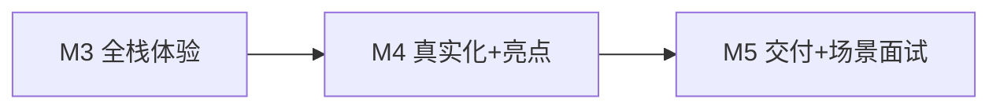

# 项目真实化规划：DevKit 研发团队文档助手

> 本文档是项目的**业务场景 + 对标 GitHub + 里程碑调整**权威说明。  
> 面试题改为**场景题**见 [qa-scenario-guide.md](./qa-scenario-guide.md)。

---

## 1. 项目重新定位

### 之前（偏 Demo）

> 「企业知识库 RAG」+ PDF 上传 + `/chat`

问题：和 2026 年大量教程项目同质，缺少业务叙事和量化指标。

### 现在（真实场景）

> **DevKit — 研发团队内部文档智能问答**  
> 服务对象：新接手 `rag-agent` 仓库的开发/实习生  
> 知识来源：**本项目真实文档**（PLAN、分步指南、qa 卡、README、代码注释）  
> 核心痛点：文档散、搜不到精确 API 名、新人反复问同样问题

这和 [onyx-dot-app/onyx](https://github.com/onyx-dot-app/onyx)（30k+ stars，接 Confluence/GitHub）解决的是**同一类问题**，只是规模适合个人/实习作品。

---

## 2. 对标 GitHub 项目（已用 `gh` 核实 star）

| Stars | 项目 | 学什么 | 我们摘什么 |
|------:|------|--------|-----------|
| **148k** | [langgenius/dify](https://github.com/langgenius/dify) | 企业知识库产品形态：上传→RAG→Agent→API | 功能 checklist，不 fork |
| **30k** | [onyx-dot-app/onyx](https://github.com/onyx-dot-app/onyx) | 企业搜索：Slack/Confluence/GitHub 文档问答 | **业务场景叙事** |
| **3.6k** | [GiovanniPasq/agentic-rag-for-dummies](https://github.com/GiovanniPasq/agentic-rag-for-dummies) | LangGraph 模块化 Agentic RAG | **M4.2 CRAG 状态机** |
| **862** | [danny-avila/rag_api](https://github.com/danny-avila/rag_api) | RAG 独立 API、按 file_id 管理文档 | **M4.1 文档 API 规范化** |
| **92** | [CliffsCai/Rag_System](https://github.com/CliffsCai/Rag_System) | 国内企业 KB：混合检索+LangGraph | **M4.3 BM25+向量 RRF** |
| **313** | [langchain-ai/rag-research-agent-template](https://github.com/langchain-ai/rag-research-agent-template) | 官方 RAG Agent 模板 | M4 目录结构参考 |

**原则**：向高 star 项目学**场景和架构**，在 `rag-agent` 里**手写精简版**，README 写明参考来源。

---

## 3. 真实用户故事（User Stories）

| 用户 | 场景 | 期望 |
|------|------|------|
| 新实习生 | 「M2 数据流怎么走？」 | 基于 `docs/M2-steps.md` 回答并引用 |
| 前端开发 | 「CORS 为什么浏览器不通？」 | 引用 `main.py` + qa-m3 相关内容 |
| 你自己 | 「召回率多少？」 | 用 `eval/` 测试集给出 **Recall@3 数字** |
| 面试官 | 「答不准怎么排查？」 | 按 Retrieve vs Generate 四层排查（见 qa-scenario-guide） |

---

## 4. 里程碑调整（在原有 M0～M5 上升级）

### M3（不变，当前进行中）

React UI + SSE + PR 流程。UI 文案改为 DevKit 场景（示例问题来自真实文档）。

### M4 拆步（**真实化 + 高 star 亮点**）

| 子步 | 做什么 | 对标 | 验收 |
|------|--------|------|------|
| **M4.0** | 写清场景 + 索引 `docs/*.md` | Onyx 文档源 | 能问「M3 分几步」 |
| **M4.1** | `eval/` 黄金测试集 20 题 + 跑批脚本 | 腾讯面经「召回率多少」 | 输出 Recall@3 基线 |
| **M4.2** | LangGraph CRAG：评分→改写→拒答 | agentic-rag-for-dummies | Bad case 不再胡编 |
| **M4.3** | BM25 + 向量混合检索 RRF | CliffsCai/Rag_System | 搜 `POST /chat` 更准 |
| **M4.4** | 请求 trace_id + 检索日志 | rag_api / 生产面经 | 能定位单次 Bad case |

详细步骤见 [M4-steps.md](./M4-steps.md)（M4 开始时创建）。

### M5（交付）

| 项 | 内容 |
|----|------|
| Docker Compose | 一键启前后端 |
| README | 场景说明 + 架构图 + 对标项目 + **评估指标截图** |
| 场景面试卡 | `docs/qa-m5-scenario.md` 20 道场景题+答案 |
| 3 分钟介绍稿 | STAR 格式：背景→难点→指标→优化 |

---

## 5. 真实文档清单（知识库内容）

M4.0 起，以下文件作为**正式知识库**（不只测简历 PDF）：

| 路径 | 类型 |
|------|------|
| `docs/PLAN.md` | 总规划 |
| `docs/M2-steps.md`, `docs/M3-steps.md` | 分步指南 |
| `docs/qa-m1.md`, `qa-m2.md`, `qa-m3.md` | 知识卡 |
| `docs/SCENARIO.md` | 本文件 |
| `README.md` | 部署手册 |

可选：继续支持 PDF（简历等），但**评估集以项目文档为准**。

---

## 6. 评估指标（面经必问，必须能答数字）

参考腾讯/美团/快手 RAG 面经，M4.1 必须产出：

| 指标 | 含义 | 目标（基线） |
|------|------|-------------|
| **Recall@3** | Top-3 检索是否包含正确文档块 | 记录基线，M4.3 后对比提升 |
| **Answer Faithfulness** | 回答是否 grounded（可简化为人工 0/1） | ≥ 80% |
| **拒答准确率** | 文档没有的问题是否拒答 | 100% on 5 道拒答题 |

存储：`eval/questions.json` + `eval/run_eval.py` + `eval/results/`（结果不入 Git 或只入 summary）

---

## 7. 场景题来源（面经归纳）

以后每步面试题**必须是场景题**，格式见 [qa-scenario-guide.md](./qa-scenario-guide.md)。

面经高频类型（已调研）：

| 类型 | 典型问法 | 来源 |
|------|----------|------|
| **量化** | 「召回率多少？怎么量的？」 | 腾讯/牛客 |
| **排查** | 「回答不准从哪开始查？」 | 腾讯云社区/派聪明 |
| **诊断** | 「Retrieve 还是 Generate 的问题？」 | RAGAS/Braintrust 文章 |
| **工程** | 「知识库更新怎么不停服？」 | 腾讯面经 |
| **场景设计** | 「百万文档你怎么设计？」 | 快手电商面经 |
| **Trade-off** | 「有没有更好的方案？」 | 美团 Keeta Agent 面经 |

---

## 8. 简历一句话（定稿方向）

> DevKit 研发团队文档助手：基于 LangGraph Agentic RAG，索引项目真实 Wiki；混合检索 + 来源引用 + 拒答；自建 20 题评估集 Recall@3 XX%；FastAPI + React + Docker。参考 Dify/Onyx 企业知识库场景，核心链路自研。

---

## 9. 当前行动项

**现在（规划阶段，本文档）**：✅ 场景定稿 + 里程碑调整 + 场景题规范

**下一步开发**：

1. 继续 **M3.1** 聊天 UI（示例问题改成 DevKit 风格）
2. M3 完成后进入 **M4.0**（Markdown 入库 + 场景 README）
3. 每步结束用**场景题**验收（不是概念题）

---

## 10. 参考链接

- [派聪明 RAG 真实面经 700 题](https://paicoding.com/real-interview-experience)
- [腾讯 RAG 面经：召回率/上下文管理](https://paicoding.com/qq-rag-interview)
- [RAG 不准四层排查](https://cloud.tencent.com/developer/article/2681659)
- [Dify README](https://github.com/langgenius/dify)
