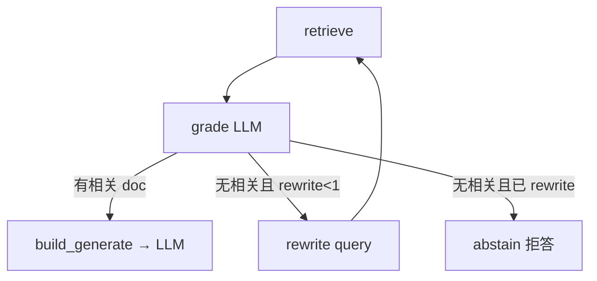

# DevKit 文档助手 — M4 面试问答

> 场景题规范见 [qa-scenario-guide.md](./qa-scenario-guide.md)  
> 业务场景见 [SCENARIO.md](./SCENARIO.md)

---

## M4.0 Markdown 入库 + DevKit 场景

### 1. 为什么 M4.0 要支持 Markdown，而不只 PDF？

- 本项目真实知识在 `docs/*.md`（PLAN、M3-steps、qa 卡），不是外部简历 PDF
- Markdown 纯文本，切块稳定；PDF 解析易乱码、表格丢失
- 面试叙事：DevKit 帮新人查**仓库自带 Wiki**，对标 Onyx 接文档源

### 2. `import_docs.py` 和上传 API 有什么区别？

| | `scripts/import_docs.py` | `POST /documents/upload` |
|---|--------------------------|---------------------------|
| 场景 | 开发者一键导入 `docs/` | 浏览器/User 上传单个文件 |
| 输入 | 批量 `docs/*.md` | 单个 `.pdf` / `.md` |
| 底层 | 同一套 `load_and_split_*` + `index_chunks` | 同上 |

### 3. 同名 Markdown 更新后向量库怎么处理？

- `store.py` 的 `index_chunks`：按 `metadata.source`（文件名）**先删旧向量再写入**
- 改 `M3-steps.md` 后重跑 `import_docs.py` 或重新上传 → 覆盖，不会双份
- **更好方案**：CI 钩子文档变更自动 re-index；生产 blue-green 索引

### M4.0 自检

- [ ] 跑过 `uv run python scripts/import_docs.py`
- [ ] 问「M3 分几步」能引用 M3-steps 内容
- [ ] 能解释 PDF vs Markdown loader 差异

### 场景题（M4.0）

**Q1：** 产品说「知识库要接 Confluence + GitHub Markdown」，你第一期怎么做？

**A：**
1. **现象**：多格式、多来源，不能一次做完。
2. **M4.0 做法**：先统一成「文本切块 + Chroma」；Markdown 用 `TextLoader` 路径；PDF 保留 PyPDFLoader。
3. **步骤**：`import_docs.py` 批导 repo 内 `docs/`；上传 API 支持 `.md` 单文件。
4. **更好方案**：Onyx 式 connector 队列；M4.0 只 prove 多格式入库。
5. **本项目**：`loader.py` 的 `load_and_split_document`；`scripts/import_docs.py`。

---

**Q2：** 运营更新了 `PLAN.md`，用户问的还是旧答案，你怎么查？

**A：**
1. **现象**：文档已改，RAG 仍答旧内容。
2. **根因**：向量库未 re-index；或 retrieve 命中旧 chunk。
3. **步骤**：确认 `index_chunks` 是否按 filename 覆盖；重跑 import；看 sources 是否来自新 chunk。
4. **更好方案**：文档 commit 触发 CI re-embed；metadata 加 `doc_version`。
5. **本项目**：`store.py` 27～29 行 delete 再 add。

---

**Q3：** 用户上传 `.docx`，后端 400，产品要支持，你怎么扩？

**A：**
1. **现象**：`SUPPORTED_SUFFIXES` 只有 `.pdf` / `.md`。
2. **做法**：加 loader（如 `UnstructuredWordDocumentLoader` 或 python-docx 抽文本）→ 进同一 `RecursiveCharacterTextSplitter` → `index_chunks`。
3. **Trade-off**：多依赖 vs 自研解析；先转 markdown 再索引更稳。
4. **更好方案**：统一「转成纯文本 pipeline」，格式只是入口 adapter。
5. **本项目**：`loader.py` 的 `SUPPORTED_SUFFIXES` + `load_and_split_document`。

---

**Q4：** 演示时不想依赖「骆健渤 PDF」，面试官问数据从哪来，你怎么答？

**A：**
1. **现象**：外部 PDF 像 Demo 数据，缺业务叙事。
2. **答法**：DevKit 索引**本仓库真实文档**；`import_docs.py` 导入 PLAN/Mx-steps/qa。
3. **验收**：问「M3 分几步」「CORS 怎么验收」→ sources 指向 `M3-steps.md` / `qa-m3.md`。
4. **更好方案**：M4.1 加 eval 集量化 Recall@3。
5. **本项目**：M4.0 验收标准；`ChatPanel` 示例问题已换 DevKit 题。

---

## M4.1 评估集 + Recall@3

### 1. Recall@3 是什么？

- 对每道题跑 **retrieve Top-3**（不调 LLM）
- 看期望来源文件（如 `M3-steps.md`）是否出现在 Top-3 任一 chunk 的 `metadata.source`
- **Recall@3** = 命中题数 / 有标答题数（`should_abstain=false`）

### 2. 为什么 M4.1 只评检索，不评生成？

- 回答不准要先拆 **Retrieve vs Generate**
- 检索没命中，生成再好也瞎编
- M4.1 建基线；M4.2 CRAG / M4.3 混合检索后再跑同一脚本对比

### 3. `questions.json` 三个字段什么意思？

| 字段 | 含义 |
|------|------|
| `question` | 用户问法 |
| `expected_sources` | 标答应来自哪些 md 文件名 |
| `should_abstain` | true = 文档没有，不参与 Recall 分子 |

### M4.1 自检

- [ ] 跑过 `uv run python eval/run_eval.py`
- [ ] 能说出 Recall@3 公式和 94.4% 基线（或你本地数字）
- [ ] 能解释 q10 为何 Miss（PLAN vs M4-steps 语义近）

### 场景题（M4.1）

**Q1：** 面试官：「你 RAG 做了三个月，召回率多少？」

**A：**
1. **现象**：没指标像 Demo。
2. **答法**：`eval/questions.json` 20 题，标 `expected_sources`；`run_eval.py` 出 Recall@3。
3. **数字**：M4.1 纯向量 **94.4%**（17/18），见 `eval/BASELINE.md`。
4. **更好方案**：上线后 RAGAS + bad case 回流 eval。
5. **本项目**：`eval/run_eval.py` + `retriever.py`。

---

**Q2：** q10「M4.2 CRAG」检索命中 PLAN 没命中 M4-steps，你怎么优化？

**A：**
1. **根因**：PLAN 有 M4 摘要，向量语义更近。
2. **短期**：eval 允许多文件 `expected_sources`；或改 chunk 边界。
3. **中期**：M4.3 BM25+RRF，精确词「LangGraph」「CRAG」拉 M4-steps。
4. **长期**：metadata 过滤（按 doc_type=steps）。
5. **本项目**：BASELINE.md Miss 表；M4.3 对比基线。

---

**Q3：** should_abstain 题为什么检索层 Hit 没意义？

**A：**
1. **现象**：问「月薪」，Top-3 仍返回 chunk。
2. **根因**：向量检索总会返回「最相似」的，不等于「能回答」。
3. **做法**：M4.1 不计入 Recall；M4.2 generate 层 grade + 拒答。
4. **更好方案**：检索分数阈值 + CRAG。
5. **本项目**：q19/q20；`run_eval.py` abstain 单独打印。

---

**Q4：** eval 跑很慢 / HuggingFace 超时怎么办？

**A：**
1. **现象**：WinError 10060 连 huggingface.co。
2. **根因**：embedding 模型每次联网校验。
3. **步骤**：先成功跑一次 import 缓存模型；再 `HF_HUB_OFFLINE=1` 跑 eval。
4. **更好方案**：CI 预缓存模型；或固定本地 embedding 路径。
5. **本项目**：`eval/BASELINE.md` 说明。

---

## M4.2 LangGraph CRAG

### 1. CRAG 和 M4.1 纯 retrieve 差在哪？

| M4.1 | M4.2 CRAG |
|------|-----------|
| retrieve Top-K 直接进 LLM | retrieve → **LLM grade** → 不相关则 **rewrite 再检** 或 **拒答** |
| 检索命中 ≠ 能回答 | grade 过滤「看着像但不能答」的 chunk |
| abstain 靠 prompt 自觉 | 无关时 **提前 abstain**，不调生成 |

### 2. LangGraph 在本项目干什么？

- **状态机**编排节点：`retrieve` → `grade` → 分支
- 不是多 Agent 聊天，是 **固定 CRAG 流程**
- 代码：`app/rag/graph.py`，`get_crag_graph().ainvoke(...)`

### 3. 三个分支怎么走？

### M4.2 自检

- [ ] 问「公司年假几天」→ 拒答，不胡编
- [ ] 能画 CRAG 状态机
- [ ] 能说出 grade / rewrite / abstain 各解决啥

### 场景题（M4.2）

**Q1：** 用户说 AI 答错了，怎么判断 Retrieve 还是 Generate？

**A：**
1. **现象**：答案和文档不符。
2. **步骤**：看 `sources` 里 chunk 是否相关；相关但答错 → Generate；不相关 → Retrieve/CRAG。
3. **工具**：M4.1 Recall@3 评检索；M4.2 grade 在运行时过滤。
4. **更好方案**：eval 加 faithfulness；bad case 回流。
5. **本项目**：`graph.py` grade 节点；`qa-scenario-guide` 四层排查。

---

**Q2：** 为什么 CRAG 要 rewrite，不直接拒答？

**A：**
1. **现象**：用户问法模糊，第一次 retrieve 偏了。
2. **根因**：query-document 语义 gap。
3. **做法**：grade 不通过 → LLM 改写 query → 再 retrieve 一次（`MAX_REWRITES=1`）。
4. **Trade-off**：多 1～2 次 LLM 调用 vs 提高召回。
5. **本项目**：`graph.py` `_rewrite_node`。

---

**Q3：** 流式接口里 CRAG 放哪一段？

**A：**
1. **现象**：SSE 要逐 token，但 grade/rewrite 不能流。
2. **做法**：`prepare_rag_stream_async` 先跑完 CRAG，再 `chat_stream` 流生成。
3. **体验**：首 token 略慢（多了 grade），但减少胡编。
4. **更好方案**：retrieve/grade 阶段返回 progress 事件。
5. **本项目**：`main.py` `chat_stream_endpoint` 先 await CRAG。

---

**Q4：** Chain、Agent、LangGraph 在本项目怎么选？

**A：**
1. **Chain**：固定 RAG 流水线，M2 够用。
2. **Agent**：LLM 自主选工具，DevKit 文档问答 overkill。
3. **LangGraph**：**固定流程 + 条件分支**（grade/rewrite/abstain），可观测、可测。
4. **本项目**：CRAG 状态机，不是开放式 Agent。

---

## M4.3 场景题（混合检索 BM25 + RRF）

**Q1：** 用户搜 `POST /chat` 搜不到，你怎么优化？

**A：**
1. **现象**：问 API 路径，Top-3 全是 PLAN/SCENARIO 摘要，没有 M3-steps 或 qa-m3。
2. **根因**：纯向量按语义相似，「聊天接口」类表述更贴近摘要，不含精确路径字符串。
3. **排查**：看 retrieve 命中 chunk 是否含字面 `POST /chat`；跑 `eval/run_eval.py --dense-only` vs 默认 hybrid 对比。
4. **方案**：加 **BM25** 稀疏检索 + **RRF** 与向量融合；入库时 Chroma 与 `data/bm25/corpus.json` 双写。
5. **本项目**：`bm25_index.py` + `retriever.py`；向量权重 1.0、BM25 0.35，避免 qa 卡关键词堆叠压过 steps。

---

**Q2：** 加了混合检索后 Recall 反而下降怎么办？

**A：**
1. **现象**：BM25 把 `qa-m4.md`（大量 M4 关键词）顶到 Top-3，M4-steps miss。
2. **根因**：RRF 两路等权时，BM25 对「关键词堆叠」文档过敏感。
3. **排查**：对比 `--dense-only` 与 hybrid 的 per-question diff；看 BM25 单路 Top-10。
4. **方案**：**加权 RRF**（向量权重大于 BM25）、调 `RRF_POOL_FACTOR`、或仅对含 `/`、驼峰 API 的问句启用 BM25。
5. **本项目**：加权后 Recall@3 回到 **94.4%**（17/18），与 M4.1 持平。

---

**Q3：** BM25 索引和 Chroma 向量怎么保持一致？

**A：**
1. **现象**：上传新 PDF 后向量能搜到，BM25 搜不到。
2. **根因**：只写了 Chroma，没同步 BM25 语料。
3. **做法**：`store.index_chunks` 内先 `sync_chunks` 再 `add_documents`；`import_docs.py` 结束调 `rebuild_from_vector_store` 全量对齐。
4. **热更新**：按 `source` 文件名删旧 chunk 再写入（与向量库同一策略）。
5. **本项目**：`data/bm25/corpus.json`，`GET /documents/stats` 可看 `bm25_count`。

---

**Q4：** 面试 30 秒怎么讲混合检索？

**A：**
> M4.1 纯向量 Recall@3 94.4%。API 路径类问题语义检索不稳，M4.3 加 rank_bm25 与向量 **加权 RRF** 融合；入库双写 Chroma + BM25。eval 复测持平，精确词（如 `POST /chat/stream`）排序更合理。下一步可加 Rerank 或 trace 日志定位 Bad case。

---
